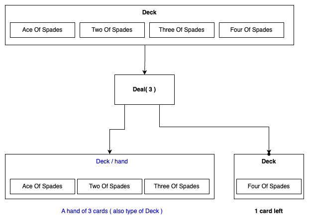

### New Deck
newDeck() => a deck of 52 cards ( eg. [ "Ace of Spades", "One of Spades" etc...])

### Deal a new hand

### Tests
1. make sure you have `go.mod` file, for exaple if your project's name is `cards`

`$ go mod init cards`

then you can run test command:

`$ go test`

2. To write a test, create a new file ending with `_test.go`, (eg. `deck_test.go`)

3. to run all tests: `$ go test`